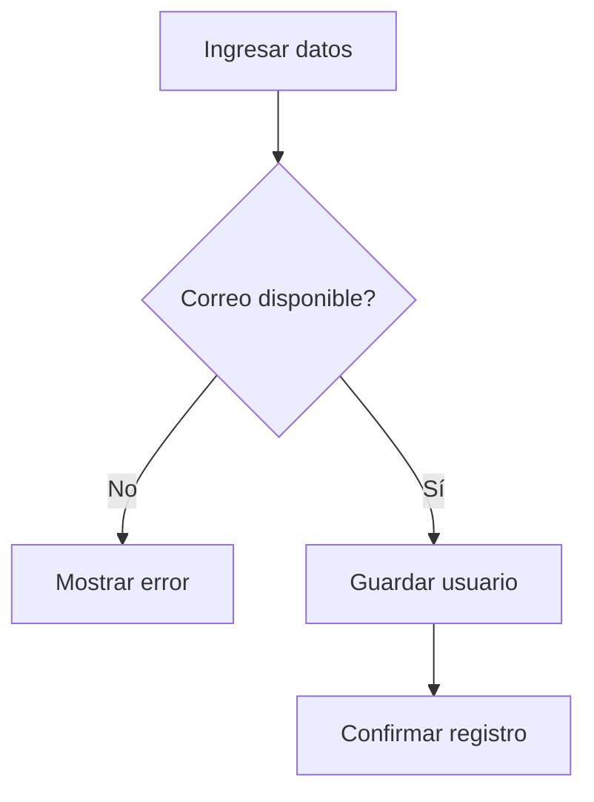
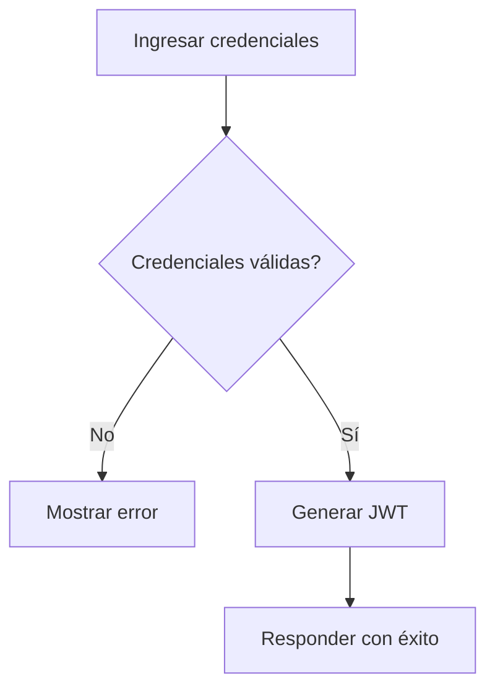
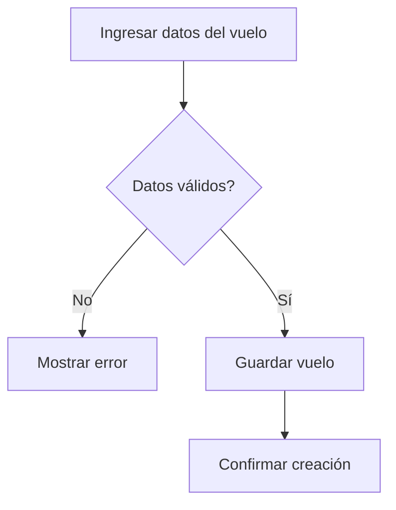
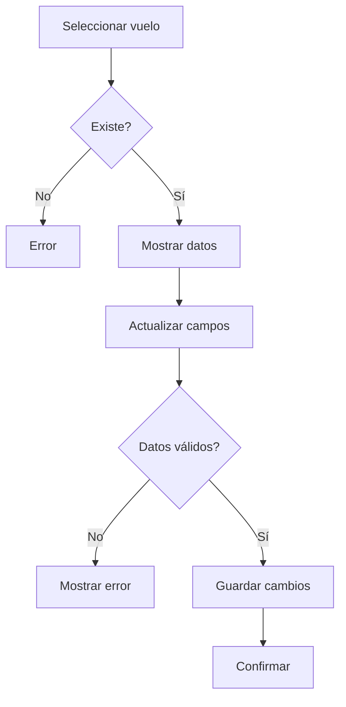
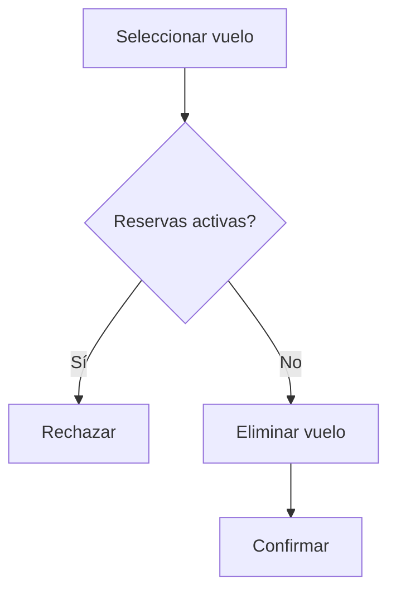
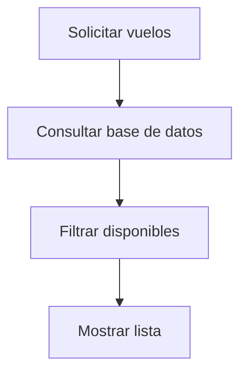
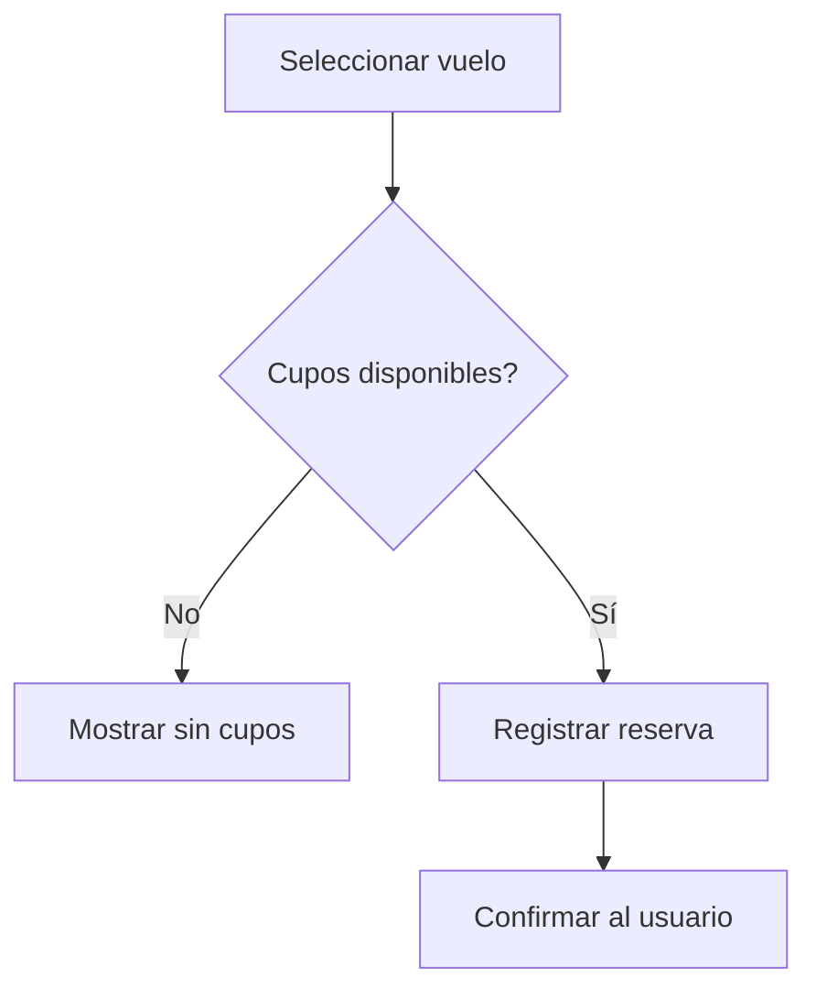
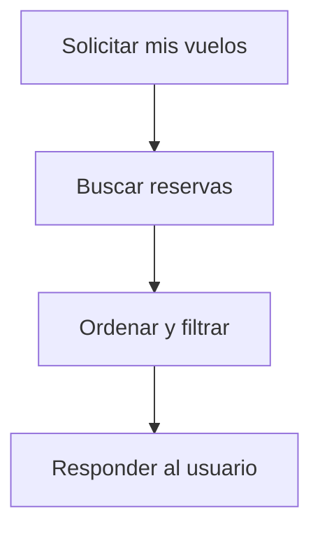
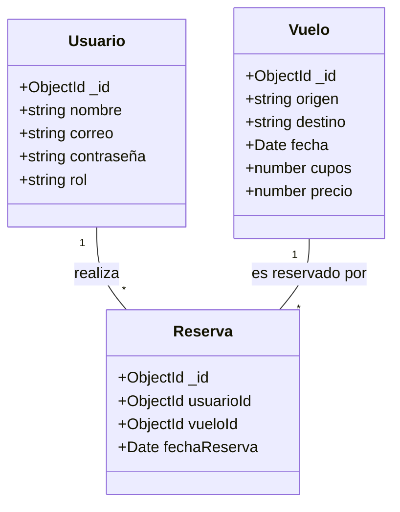

# Documentación Completa - Agencia de Viajes

## 1. Visión General
La presente documentación describe la arquitectura, requisitos, casos de uso y plan de desarrollo del sistema de **Agencia de Viajes**. El objetivo es ofrecer una API REST basada en **Node.js** y **Express** que gestione vuelos y reservas utilizando **MongoDB**, adoptando los principios de **Clean Architecture** y el ciclo de vida **RUP**.

El sistema permite a los usuarios registrarse, iniciar sesión y agendar vuelos disponibles. Los administradores pueden gestionar la oferta de vuelos. Se busca una solución escalable, mantenible y lista para producción.

## 2. Requisitos
### 2.1 Requisitos Funcionales
1. Registro de usuarios mediante correo y contraseña.
2. Inicio de sesión con generación de token JWT.
3. Gestión de vuelos (solo administradores):
   - Agregar nuevos vuelos.
   - Editar información de vuelos existentes.
   - Eliminar vuelos.
4. Visualización de vuelos disponibles.
5. Agendamiento de vuelos con cupos.
6. Consulta de vuelos agendados y próximos.
7. Gestión de roles (usuario/administrador).

### 2.2 Requisitos No Funcionales
- Rendimiento: respuestas < 500 ms bajo carga normal.
- Escalabilidad horizontal mediante contenedores.
- Seguridad con autenticación JWT y cifrado de contraseñas.
- Disponibilidad >= 99%.
- Mantenibilidad siguiendo Clean Architecture y linters.
- Portabilidad gracias a Docker y despliegue containerizado.

## 3. Casos de Uso
A continuación se listan los principales casos de uso del sistema.

### 3.1 Registrarse
- **Descripción:** Permite a un visitante crear una cuenta.
- **Actor principal:** Visitante.
- **Precondiciones:** No estar previamente registrado.
- **Flujo normal:**
  1. Ingresar datos personales, correo y contraseña.
  2. Verificar que el correo no exista.
  3. Guardar usuario y confirmar registro.
- **Flujos alternativos:** Correo existente ➜ mostrar error.
- **Reglas de negocio:** Contraseña debe cumplir políticas de seguridad.
- **Entradas:** Nombre, correo, contraseña.
- **Salidas:** Confirmación de registro.
- **Diagrama:**


### 3.2 Iniciar Sesión
- **Descripción:** Autentica a un usuario registrado.
- **Actor principal:** Usuario registrado.
- **Precondiciones:** Cuenta activa.
- **Flujo normal:**
  1. Proporcionar correo y contraseña.
  2. Validar credenciales.
  3. Generar token JWT y responder.
- **Flujos alternativos:** Credenciales inválidas ➜ mostrar error.
- **Reglas de negocio:** Contraseñas cifradas, tokens con vigencia.
- **Entradas:** Correo, contraseña.
- **Salidas:** Token JWT, datos básicos.
- **Diagrama:**


### 3.3 Agregar Vuelo (Admin)
- **Descripción:** Crea un nuevo vuelo.
- **Actor principal:** Administrador.
- **Precondiciones:** Sesión iniciada como admin.
- **Flujo normal:**
  1. Ingresar datos del vuelo.
  2. Validar información.
  3. Guardar vuelo y confirmar.
- **Flujos alternativos:** Datos inválidos ➜ solicitar corrección.
- **Reglas de negocio:** No permitir fechas pasadas.
- **Entradas:** Origen, destino, fecha, cupos, precio.
- **Salidas:** Detalle del vuelo creado.
- **Diagrama:**


### 3.4 Editar Vuelo (Admin)
- **Descripción:** Actualiza un vuelo existente.
- **Actor principal:** Administrador.
- **Precondiciones:** Sesión iniciada, vuelo existente.
- **Flujo normal:**
  1. Seleccionar vuelo.
  2. Mostrar información actual.
  3. Actualizar campos y validar.
  4. Guardar cambios y confirmar.
- **Flujos alternativos:** Vuelo inexistente ➜ error.
- **Reglas de negocio:** No fechas anteriores a hoy.
- **Entradas:** ID del vuelo y nuevos datos.
- **Salidas:** Confirmación del vuelo actualizado.
- **Diagrama:**


### 3.5 Eliminar Vuelo (Admin)
- **Descripción:** Elimina un vuelo del sistema.
- **Actor principal:** Administrador.
- **Precondiciones:** Sesión iniciada, vuelo sin reservas futuras.
- **Flujo normal:**
  1. Seleccionar vuelo a eliminar.
  2. Validar ausencia de reservas activas.
  3. Eliminar vuelo y confirmar.
- **Flujos alternativos:** Vuelo con reservas ➜ rechazar operación.
- **Reglas de negocio:** No eliminar vuelos con reservas futuras.
- **Entradas:** ID del vuelo.
- **Salidas:** Confirmación de eliminación.
- **Diagrama:**


### 3.6 Visualizar Vuelos
- **Descripción:** Muestra vuelos disponibles.
- **Actor principal:** Usuario o visitante.
- **Precondiciones:** Existencia de vuelos vigentes.
- **Flujo normal:**
  1. Solicitar lista de vuelos.
  2. Recuperar vuelos con cupos y fecha futura.
  3. Devolver lista al solicitante.
- **Reglas de negocio:** Solo mostrar vuelos con cupos.
- **Entradas:** Ninguna.
- **Salidas:** Listado de vuelos.
- **Diagrama:**


### 3.7 Agendar Vuelo
- **Descripción:** Reserva un vuelo disponible.
- **Actor principal:** Usuario autenticado.
- **Precondiciones:** Sesión iniciada, vuelo con cupos.
- **Flujo normal:**
  1. Seleccionar vuelo.
  2. Verificar disponibilidad de cupos.
  3. Registrar reserva y descontar cupo.
  4. Confirmar reserva al usuario.
- **Flujos alternativos:** Sin cupos ➜ cancelar operación.
- **Reglas de negocio:** Un usuario no agenda el mismo vuelo más de una vez.
- **Entradas:** ID del vuelo, token del usuario.
- **Salidas:** Confirmación y detalle de la reserva.
- **Diagrama:**


### 3.8 Ver Vuelos Agendados
- **Descripción:** Consulta vuelos agendados y próximos.
- **Actor principal:** Usuario autenticado.
- **Precondiciones:** Sesión iniciada.
- **Flujo normal:**
  1. Solicitar vuelos agendados.
  2. Recuperar reservas del usuario.
  3. Ordenar por fecha y resaltar próximos (≤30 días).
  4. Responder con la información.
- **Reglas de negocio:** Definir vuelos próximos como los que ocurren en 30 días.
- **Entradas:** Token del usuario.
- **Salidas:** Lista de vuelos agendados con indicador de proximidad.
- **Diagrama:**


## 4. Diagramas
- **Diagrama de Clases:**


## 5. Diseño
### 5.1 Arquitectura
El proyecto adopta **Clean Architecture** para separar responsabilidades en capas independientes:
- **Dominio:** entidades y contratos de repositorios.
- **Aplicación:** orquesta casos de uso y servicios.
- **Infraestructura:** implementaciones técnicas (Mongoose, Express).
- **Interfaces:** controladores y rutas HTTP.

Esta separación favorece mantenibilidad y permite cambiar tecnologías sin afectar la lógica de negocio. En el ciclo de vida **RUP**, cada iteración entrega incrementos funcionales en estas capas, facilitando validaciones tempranas y adaptación a cambios.

### 5.2 Patrones Aplicados
- Inyección de dependencias entre capas.
- Repositorio para abstracción de datos.
- DTOs y servicios para orquestación de casos de uso.

## 6. Desarrollo
### 6.1 Estructura de Carpetas
```
codigo/
└── src
    ├── domain
    │   ├── entities
    │   ├── repositories
    │   └── use-cases
    ├── infrastructure
    │   └── database
    ├── application
    │   └── services
    └── interfaces
        └── controllers
```
Esta estructura refleja las capas de Clean Architecture, aislando la lógica de negocio de las dependencias externas.

### 6.2 Buenas Prácticas
- Uso de linters y formateadores.
- Manejo centralizado de errores.
- Validación de datos de entrada.
- Comentarios JSDoc en funciones y clases.
- Nombres descriptivos en variables y métodos.
- Versionado semántico y control de cambios con Git.

## 7. Pruebas
### 7.1 Estrategia de Pruebas
Se aplicará una estrategia mixta:
- Pruebas unitarias para casos de uso y servicios.
- Pruebas de integración para rutas y base de datos.
- Pruebas end-to-end para escenarios completos.
- Pruebas de rendimiento para operaciones críticas.
Las pruebas se automatizarán con Jest y se ejecutarán en la integración continua.

### 7.2 Casos de Prueba
| ID | Caso | Entrada | Salida esperada |
|----|------|---------|-----------------|
| CP-01 | Registro exitoso | Datos válidos | Usuario creado |
| CP-02 | Registro con correo existente | Correo ya registrado | Mensaje de error |
| CP-03 | Inicio de sesión válido | Credenciales correctas | Token JWT |
| CP-04 | Agendar vuelo sin cupos | Vuelo sin disponibilidad | Error de cupos |
| CP-05 | Agregar vuelo con fecha pasada | Fecha < hoy | Rechazo de creación |

## 8. Despliegue
### 8.1 Proceso de Despliegue
1. Construir imagen Docker de la aplicación.
2. Ejecutar pruebas automatizadas.
3. Publicar imagen en registro privado.
4. Desplegar en entorno de staging para validación.
5. Promover a producción con orquestador (Kubernetes o similar).
6. Monitorear y verificar post-despliegue.

### 8.2 Herramientas DevOps
- Docker para contenedorización.
- Docker Compose/Kubernetes para orquestación.
- GitHub Actions para CI/CD.
- SonarQube para análisis estático.
- Prometheus y Grafana para monitoreo.

## 9. Roadmap
| Fase | Actividades principales | Resultado |
|------|------------------------|-----------|
| Iteración 1 | Registro e inicio de sesión | Módulo de autenticación operativo |
| Iteración 2 | Gestión de vuelos para administradores | CRUD de vuelos disponible |
| Iteración 3 | Agendamiento y consulta de reservas | Motor de reservas funcionando |
| Iteración 4 | Pruebas, optimización y despliegue | Sistema listo para producción |
