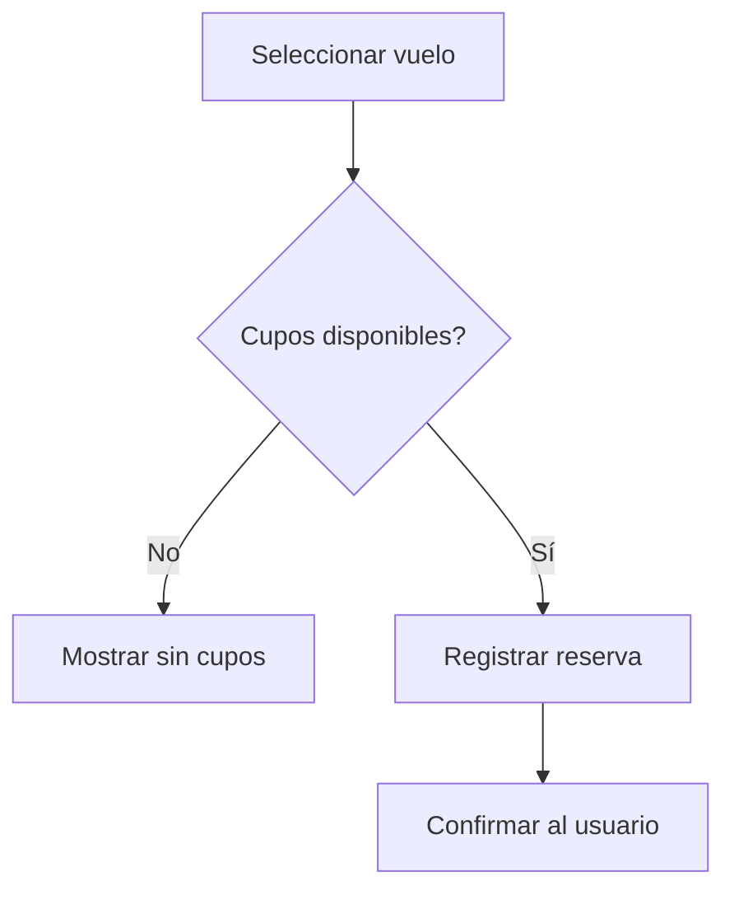

# Caso de Uso: Agendar Vuelo

## Descripción
Permite a un usuario reservar un vuelo disponible.

## Actor Principal
Usuario autenticado.

## Precondiciones
- El usuario ha iniciado sesión.
- Existe un vuelo con cupos disponibles.

## Flujo Normal
1. El usuario selecciona un vuelo disponible.
2. El sistema verifica la disponibilidad de cupos.
3. El sistema registra la reserva y descuenta un cupo.
4. El sistema confirma la reserva al usuario.

## Flujos Alternativos
- **Sin cupos:** se informa al usuario y se cancela la operación.

## Reglas de Negocio
- Un usuario no puede agendar el mismo vuelo más de una vez.

## Entradas
- Identificador del vuelo
- Token del usuario

## Salidas
- Confirmación de la reserva
- Detalle del vuelo reservado

## Diagrama de Flujo

