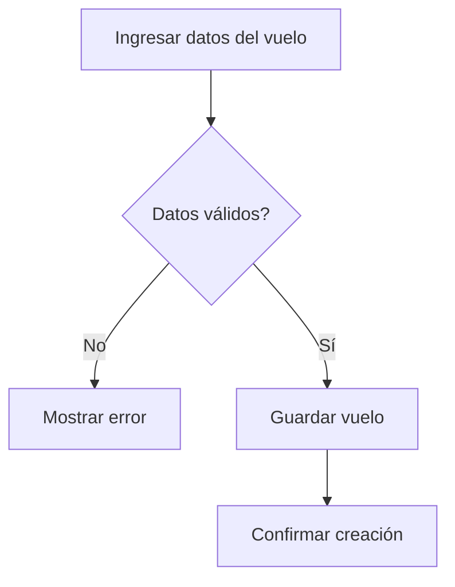

# Caso de Uso: Agregar Vuelo (Admin)

## Descripción
Permite a un administrador crear un nuevo vuelo en el sistema.

## Actor Principal
Administrador.

## Precondiciones
- El usuario ha iniciado sesión con rol de administrador.

## Flujo Normal
1. El administrador ingresa datos del vuelo (origen, destino, fecha, cupos, precio).
2. El sistema valida la información.
3. El sistema almacena el vuelo y confirma la operación.

## Flujos Alternativos
- **Datos inválidos:** se notifica y se solicita corregir.

## Reglas de Negocio
- No se permiten vuelos con fechas pasadas.

## Entradas
- Datos del vuelo

## Salidas
- Confirmación y detalle del vuelo creado

## Diagrama de Flujo

