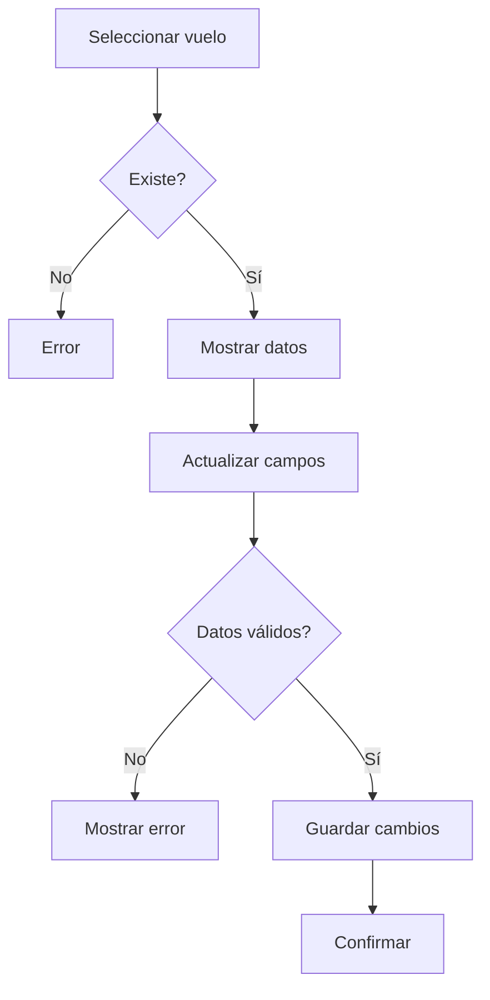

# Caso de Uso: Editar Vuelo (Admin)

## Descripción
Permite a un administrador actualizar la información de un vuelo existente.

## Actor Principal
Administrador.

## Precondiciones
- El administrador ha iniciado sesión.
- El vuelo existe.

## Flujo Normal
1. El administrador selecciona el vuelo a modificar.
2. El sistema muestra la información actual.
3. El administrador actualiza los campos necesarios.
4. El sistema valida y guarda los cambios.
5. Se confirma la actualización.

## Flujos Alternativos
- **Vuelo inexistente:** se informa el error.

## Reglas de Negocio
- No se permiten fechas anteriores a la actual.

## Entradas
- Identificador del vuelo
- Nuevos datos

## Salidas
- Confirmación del vuelo actualizado

## Diagrama de Flujo

