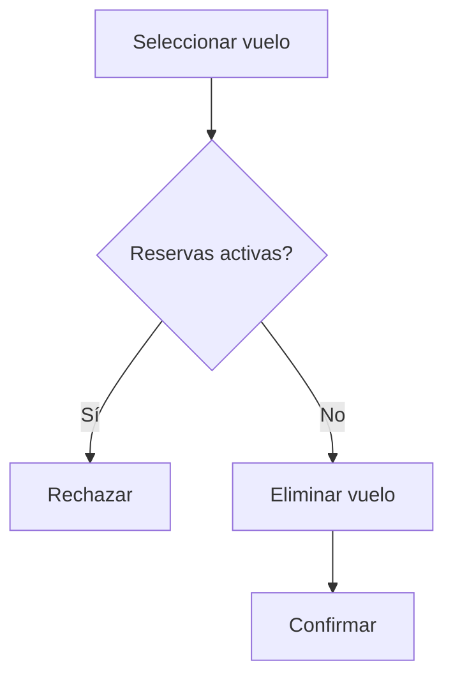

# Caso de Uso: Eliminar Vuelo (Admin)

## Descripción
Permite a un administrador eliminar un vuelo del sistema.

## Actor Principal
Administrador.

## Precondiciones
- El administrador ha iniciado sesión.
- El vuelo existe y no tiene reservas vigentes.

## Flujo Normal
1. El administrador selecciona el vuelo a eliminar.
2. El sistema valida que no tenga reservas activas.
3. El sistema elimina el vuelo.
4. Se confirma la eliminación.

## Flujos Alternativos
- **Vuelo con reservas:** se rechaza la operación.

## Reglas de Negocio
- No se pueden eliminar vuelos con reservas futuras.

## Entradas
- Identificador del vuelo

## Salidas
- Confirmación de eliminación

## Diagrama de Flujo

