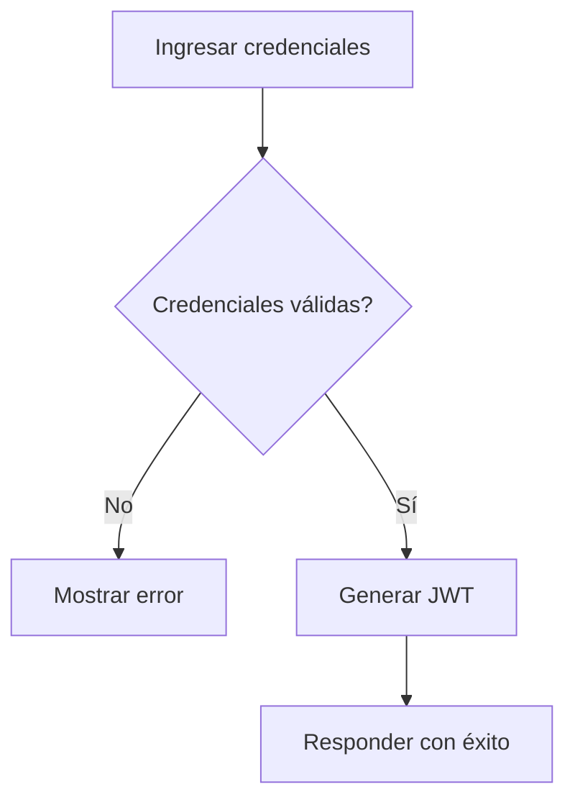

# Caso de Uso: Iniciar Sesión

## Descripción
Permite a un usuario autenticarse en el sistema para acceder a funcionalidades protegidas.

## Actor Principal
Usuario registrado.

## Precondiciones
- El usuario está registrado y su cuenta está activa.

## Flujo Normal
1. El usuario proporciona correo y contraseña.
2. El sistema valida las credenciales.
3. El sistema genera un token JWT y retorna confirmación de acceso.

## Flujos Alternativos
- **Credenciales inválidas:** se informa al usuario y se solicita reintentar.

## Reglas de Negocio
- Las contraseñas se almacenan cifradas.
- Los tokens tienen una vigencia predefinida.

## Entradas
- Correo electrónico
- Contraseña

## Salidas
- Token de autenticación
- Datos básicos del usuario

## Diagrama de Flujo

