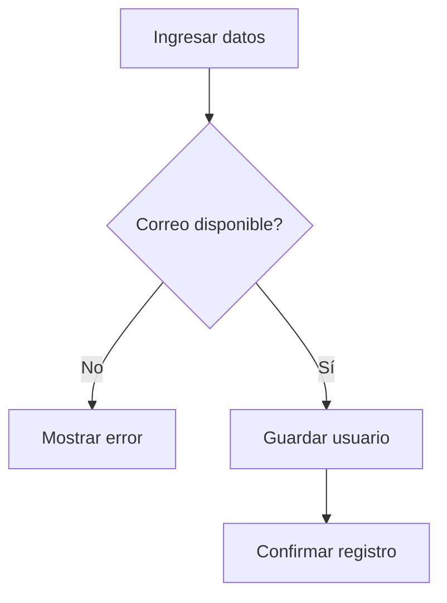

# Caso de Uso: Registrarse

## Descripción
Permite a un nuevo usuario crear una cuenta en el sistema.

## Actor Principal
Visitante.

## Precondiciones
- El usuario no debe estar previamente registrado.

## Flujo Normal
1. El visitante ingresa datos personales, correo y contraseña.
2. El sistema valida que el correo no esté registrado.
3. El sistema almacena los datos y confirma la creación de la cuenta.

## Flujos Alternativos
- **Correo existente:** se notifica al usuario y se solicita otro correo.

## Reglas de Negocio
- La contraseña debe cumplir políticas de seguridad mínimas.

## Entradas
- Nombre
- Correo electrónico
- Contraseña

## Salidas
- Confirmación de registro

## Diagrama de Flujo

