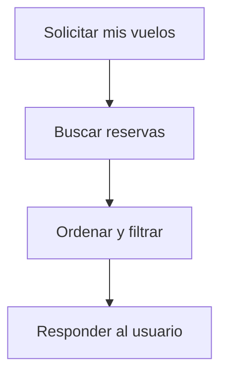

# Caso de Uso: Ver Vuelos Agendados

## Descripción
Permite a un usuario consultar los vuelos que ha agendado y aquellos próximos a la fecha actual.

## Actor Principal
Usuario autenticado.

## Precondiciones
- El usuario ha iniciado sesión.

## Flujo Normal
1. El usuario solicita sus vuelos agendados.
2. El sistema recupera las reservas del usuario.
3. El sistema ordena por fecha y resalta los vuelos próximos.
4. El sistema devuelve la información al usuario.

## Reglas de Negocio
- Los vuelos próximos se definen como aquellos que ocurren en los próximos 30 días.

## Entradas
- Token del usuario

## Salidas
- Listado de vuelos agendados
- Indicador de proximidad

## Diagrama de Flujo

