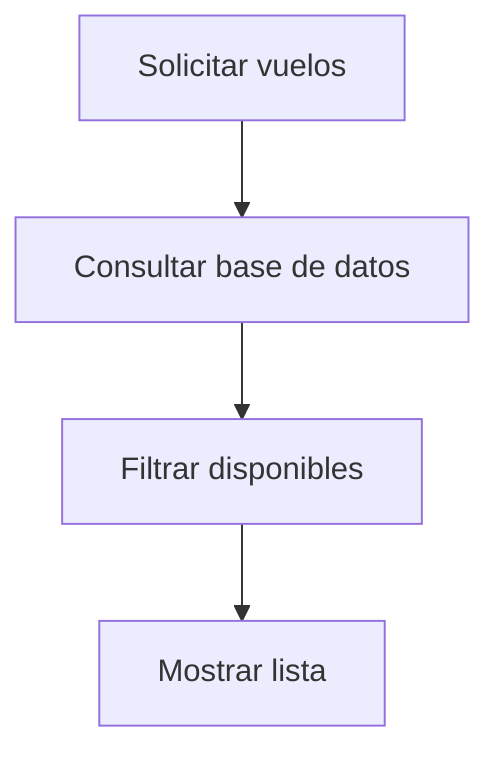

# Caso de Uso: Visualizar Vuelos

## Descripción
Permite a cualquier usuario consultar la lista de vuelos disponibles.

## Actor Principal
Usuario o visitante.

## Precondiciones
- Debe existir al menos un vuelo vigente.

## Flujo Normal
1. El usuario solicita la lista de vuelos.
2. El sistema recupera los vuelos con cupos y fecha futura.
3. El sistema devuelve la lista al usuario.

## Reglas de Negocio
- Solo se muestran vuelos con cupos disponibles.

## Entradas
- Ninguna

## Salidas
- Listado de vuelos

## Diagrama de Flujo

