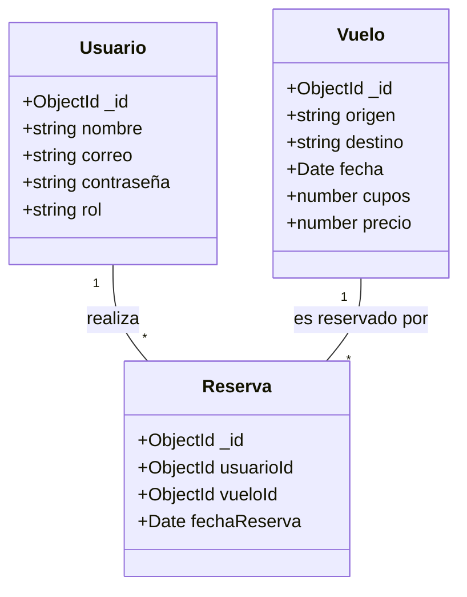

# Diagrama de Clases

La lógica de negocio se implementa mediante casos de uso que interactúan con entidades y repositorios. Las capas de infraestructura proveen implementaciones concretas de persistencia, mientras que la capa de aplicación coordina servicios y controladores Express.
