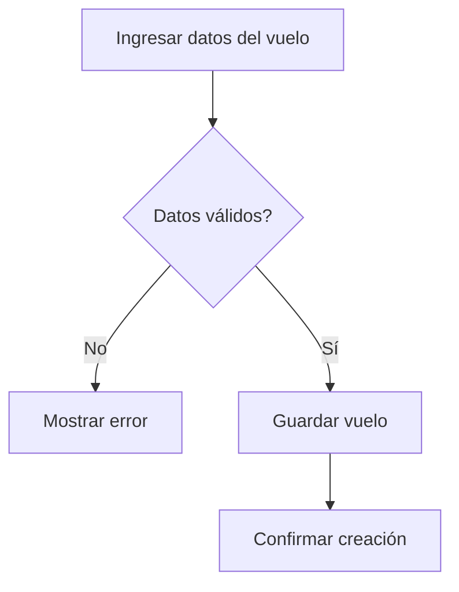

# Diagrama de Flujo - Agregar Vuelo

```mermaid
flowchart TD
    A[Ingresar datos del vuelo] --> B{Datos válidos?}
    B -- No --> C[Mostrar error]
    B -- Sí --> D[Guardar vuelo]
    D --> E[Confirmar creación]
```
